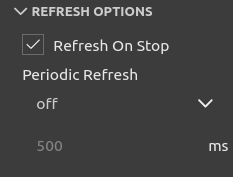
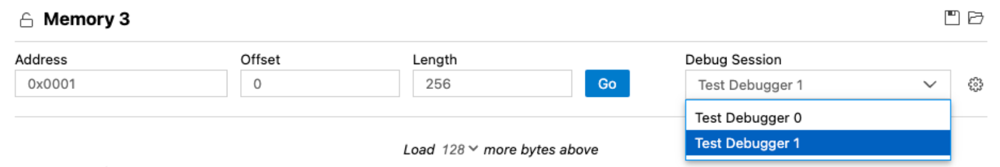

# Memory Inspector

A Visual Studio Code extension that provides a powerful and configurable memory viewer that works with debug adapters.

## Features

- **Configurable Memory Display**: Shows memory data with various display options.
- **Address Navigation**: Easily jump to and scroll through memory addresses.
- **Variable Highlights**: Colors memory ranges for variables.
- **Multiple Memory Formats**: Shows memory data on hover in multiple formats.
- **Edit Memory**: Allows in-place memory editing, if the debug adapter supports the `WriteMemoryRequest`.
- **Memory Management**: Enables saving and restoring memory data for specific address ranges (Intel Hex format).
- **Customized Views**: Create and customize as many memory views as you need.
- **Lock Views**: Keep views static, unaffected by updates from the debug session.
- **Periodic Refresh**: Automatically refresh the memory data.
- **Multiple Debug Sessions**: Switch between multiple debug sessions using a dropdown in the memory view.
- And much more

## Getting Started

### Prerequisites

1. **Install**: Add the extension to VS Code.
2. **Verify Debugger Capability**: Ensure the debug adapter supports [`ReadMemory` requests](https://microsoft.github.io/debug-adapter-protocol/specification#Requests_ReadMemory).
3. **Enable Debug Type**: Enable the Memory Inspector for the debug configuration type (VS Code setting _Debug Types_: `memory-inspector.debugTypes`).

### Use Memory Inspector

1. **Debug Session**: Start a debug session.
2. **Open Memory Inspector**: Either run the _Memory: Show Memory Inspector_ command or right-click a variable in the Variables view and select _Show in Memory Inspector_.
3. **Adjust View**: Modify the memory range you're interested in, as needed.

## Configuration

Use the gear symbol in each memory view to customize the individual settings like columns, grouping, and formats.
Default settings can be adjusted in the VS Code settings of this extension.

### Memory Format Settings

The Memory Format settings allow to configure how data that is read from the target system is interpreted and displayed.
Use the following to adjust the view to your needs and the inspected memory architecture:

1. **Bytes per MAU**: The number of _Bytes_ that form the Minimum Addressable Unit. It commonly is a fixed number for a specific target hardware. Use for example a value of `1` for byte-addressable architectures.
2. **MAUs per Group**: The number of _MAUs_ that form a _Group_ considering the selected _Endianess_. Use for example a value of `2` to form a 4-byte value consisting of `2` 2-byte MAUs.
3. **Groups per Row**: Number of _Groups_ to display in a row. This can be a fixed number of _Groups_. Or the value `Autofit` to let the Memory Inspector calculate the best utilization of space in the `Data` column.
4. **Group Endianess**: The order of _MAUs_ within a _Group_. The value can be `Little Endian` or `Big Endian`.

The following terminology is used:

- **Byte**: A data unit of 8 Bits.
- **MAU (Minimum Addressable Unit)**: A Minimum Addressable Unit of memory. It consists of one or more _Bytes_ represented by a single address.
- **Group**: A group of _MAUs_ that forms a data value. _Groups_ are the Memory Inspector's default granularity to edit memory contents.
- **Row**: A row in the Memory Inspector display containing multiple _Groups_.
- **Endianess**: The order of displaying _MAUs_ within a _Group_.

### Periodic Updates

The Memory Inspector can automatically refresh displayed memory data based on different triggers. You can configure the auto-refresh behavior using the following options:

- **On Stop**: Refreshes memory data when the program papuses.
- **Periodic Refresh**: Refreshes memory data after a specified delay.
  - **Always**: Refreshes memory data continuously, regardless of the program execution state.
  - **While Running**: Refreshes memory data only when the program is running.
  - **Off**: Disables automatic refresh of memory data.

These settings can be adjusted individually for each Memory Inspector view or globally in the preferences.

### Multiple Debug Sessions

The Memory Inspector supports multiple debug sessions. If multiple debug sessions are active, a dropdown appears in the memory view which allows you to switch between them. This enables you to target different debug sessions in multiple windows, simultaneously.

## Contributing

We welcome contributions on [GitHub](https://github.com/eclipse-cdt-cloud/vscode-memory-inspector).
Check our [contribution guidelines](./CONTRIBUTING.md) for more info.
This open-source project is part of [Eclipse CDT Cloud](https://eclipse.dev/cdt-cloud/).

## Behind the Scenes

### The Memory Provider

The primary entry point for the backend functionality of the plugin is the the [`MemoryProvider`](./src/plugin/memory-provider.ts) class. That class
has two primary functions: it handles requests that are specified by the [Debug Adapter Protocol](https://microsoft.github.io/debug-adapter-protocol/),
and it instantiates custom handlers that can provide additional functionality depending on the capabilities of a given debug adapter. In order to
register custom capabilities, the [`AdapterRegistry`](./src/plugin/adapter-registry/adapter-registry.ts) matches debug types to objects implementing
the [`AdapterCapabilities`](./src/plugin/adapter-registry/adapter-capabilities.ts) interface.

### Memory Widget

The [`MemoryWidget`](./src/webview/components/memory-widget.tsx) is a wrapper around two functional widgets, a `MemoryOptionsWidget` and a`MemoryTableWidget`.
The [`OptionsWidget`](./src/webview/components/options-widget.tsx) is responsible for configuring the display and fetching memory, and the
[`MemoryTable`](./src/webview/components/memory-table.tsx) renders the memory according to the options specified by the user in the options.
